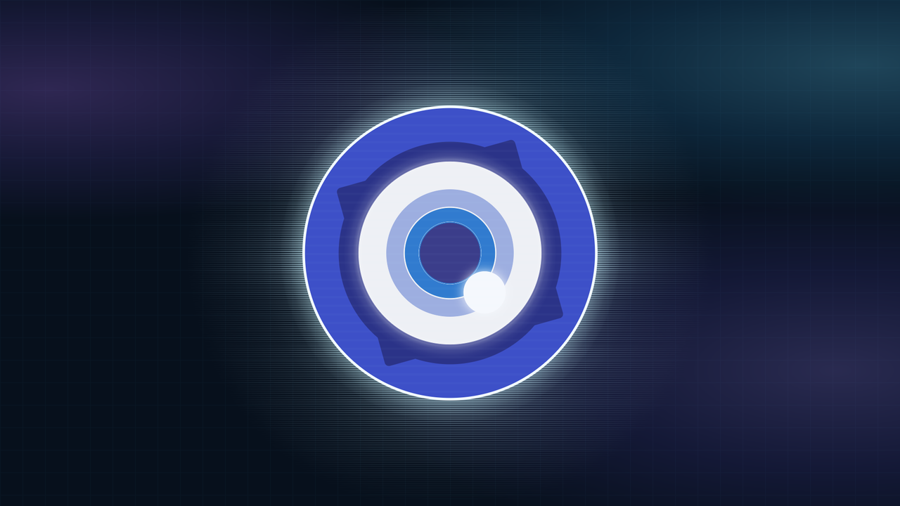
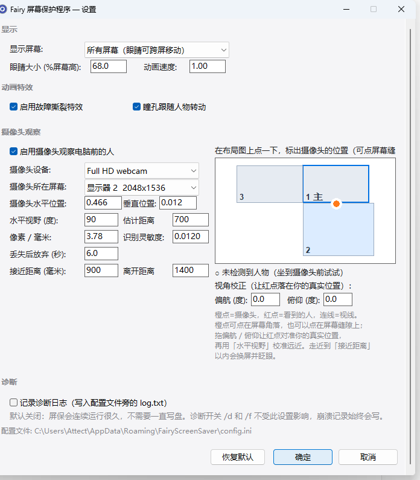

# FairyScreenSaver

**绝区零 Fairy 屏幕保护程序** · **Zenless Zone Zero Fairy Screen Saver**

用 **Rust + Vulkan** 从零实现的 Windows 屏幕保护程序（屏保）。画面是《绝区零》
（Zenless Zone Zero / ZZZ）里 **Fairy** 那只蓝色大眼睛，配深蓝色科技感背景 ——
整只眼睛由片元着色器**程序化绘制**，没有一张贴图、没有顶点缓冲、没有混合状态。

支持**多显示器**、**摄像头人脸注视**、**DPI 感知**，单文件绿色免安装，不需要
Vulkan SDK，也不需要下载任何模型文件。

> **English** — A Windows **screensaver** written from scratch in **Rust + Vulkan**,
> showing the big blue eye of *Fairy* from *Zenless Zone Zero* (ZZZ). The whole eye is
> drawn procedurally in a single fragment shader — no textures, no vertex buffers, no
> blend state. Multi-monitor aware, with optional **webcam face tracking** so the pupil
> follows you around the room and the eye hops to whichever screen you are nearest to.
> Standard screen saver protocol (`/s` `/c` `/p`), MIT licensed, Windows 10/11 with
> Vulkan 1.1+.



   

## 技术栈

`Rust` · `Vulkan`（`ash` 裸绑定）· `WGSL`（构建期由 `naga` 编到 SPIR-V）·
`windows-sys`（Win32）· `windows` + `windows-future`（WinRT）·
`nokhwa` + Media Foundation（摄像头采集）·
WinRT `Windows.Media.FaceAnalysis`（人脸检测）· `comctl32 v6` + DWM（设置界面）

## 特性
* **全程序化渲染** —— 整屏由一个全屏三角形的片元着色器逐层合成，透明用 alpha
  的 source-over 手算。眼睛包围盒之外的像素直接跳过整段计算。
* **多显示器** —— 每个显示器一个全屏窗口 + 一条独立交换链，默认只在主屏显示。
* **摄像头注视** —— 用人脸检测判断你在哪，眼睛按**真实几何**转向你；人靠得够近
  时会换到离他最近的那块屏幕，跨屏时叠故障撕裂 + 一次完整眨眼。
* **接近 / 离开** —— 双距离阈值迟滞，往椅背上一靠不会闪烁，走开才释放。
* **标准屏保协议** —— `/s` `/c` `/p` `/d` `/f` 全部支持，可在系统「屏幕保护程序
  设置」里正常预览与配置。
* **零模型文件** —— 人脸检测走系统自带的 `Windows.Media.FaceAnalysis`，不需要
  下载任何权重。

### 怎么退出屏保

**点击或按键退出，移动鼠标不退出。**

标准屏保的约定是「任何鼠标移动就退出」，但这条前提在实用中站不住：Windows 在
全屏置顶窗口升起的过程中会自己发出一连串 `WM_MOUSEMOVE`，桌面上的光学鼠标也会
一直抖，结果是屏保刚出现几秒就自己退了 —— 而且看起来像是程序崩了。所以判定条件
换成明确的输入：**任意鼠标按钮、任意按键**。

判定同时走两条路（都在 `src/app.rs`）：

* 窗口过程收 `WM_LBUTTONDOWN/UP`、`WM_KEYDOWN` 等消息；
* 主循环每帧轮询 `GetAsyncKeyState`，覆盖整个虚拟键范围。这一条**不依赖键盘
  焦点** —— 手动启动的屏保不一定抢得到前台权限，那时按键消息根本不会送到窗口，
  而轮询读的是物理键状态，照样能退出。

启动后前 400ms 的输入会被忽略，用来滤掉「启动屏保那次点击的尾巴」和启动瞬间
就已经按着的键。

---

## 构建与安装

```powershell
powershell -ExecutionPolicy Bypass -File package.ps1   # 构建 + 产出 dist\FairyScreenSaver.scr
```

| 依赖 | 说明 |
| --- | --- |
| Rust | 1.85+（发布时使用 1.96.1），MSVC 工具链 |
| Vulkan 运行时 | 由显卡驱动提供（`C:\Windows\System32\vulkan-1.dll`） |
| 着色器 | 构建期由 `naga` 把 WGSL 编成 SPIR-V，**不需要 Vulkan SDK** |
| 资源 | 图标由 `tools/make_icon.py` 生成，`rc.exe`（Windows SDK）或 `windres`（MinGW）编译 |

只想编译不打包：

```bash
cargo build --release
```

> 本仓库**不提交构建产物**。`dist/` 与 `target/` 都在 `.gitignore` 里；编译好的
> `.scr` 见 [Releases](../../releases)。

安装：右键 `dist\FairyScreenSaver.scr` → **安装**；或复制到 `%WINDIR%\System32`
（需管理员）。`.scr` 只是改了扩展名的 exe，Windows 屏幕保护程序的全部约定就是那
几个命令行开关。

### 命令行开关

```
+-------------------------------- config.ini 里的键名见下文 ------------------+
|  /s  运行屏保          /c  设置界面          /p <hwnd>  缩略预览           |
|  /d  诊断 + 摄像头探测  /f <图片> 单图检测     (无参数) 设置界面            |
+---------------------------------------------------------------------------+
```

---

## 视觉效果

每个参数都逐条对照参考项目 [Fairy-DSH](https://github.com/Chengzhibense/Fairy-DSH)
的 SVG / CSS：

| 元素 | 来源 | 说明 |
| --- | --- | --- |
| 背景底色 / 网格 | `style.js` `.dsh-hdd-fx:before` | `#07101c` + 48px 青色网格 |
| 三团辉光 | `.dsh-hdd-glow-a/b/c` | 椭圆径向渐变，单位是 `vmax`/`vh`（**视口的 1%**） |
| 外圈蓝盘 | `mascot-eye-svg.js` | r=68 线性渐变 + 1.2 宽白色描边 |
| 四角眼睫 | 同上 | `circle(51.75) ∪ roundRect(86×86,r=2)`，恒定 15s 转一圈 |
| 眼白 / 虹膜 / 瞳孔 | 同上 | r=48 / 33 / 24.15 / 23.5 / 16.6 / 16，逐层呼吸缩放 |
| 高光 | 同上 | (98,100.5) r=11 + 18 半径光晕 |
| 横向光丝 | `mascot-effects-svg.js` | 229 条正弦长度渐变的横线 + 25 段亮度蒙版 |
| 扩散脉冲环 | 同上 | r=52，scale .98→2.78，周期 `1.44 + 2.56/rate` 秒 |
| 故障撕裂 | `mascot-runtime.js` | `threads`（横向噪声位移）/ `blocks`（5 段横条错位）交替 |

呼吸动画使用参考项目的 **1440ms 主时钟**与同一条 `cubic-bezier(.72,0,.28,1)`
缓动，四层眼球的相位差（0 / 45 / 90 / 180 ms）完全一致。

### 与参考实现的像素级比对

```bash
node tools/reference_snapshot.js <Fairy-DSH客户端目录> reference.html 734
chrome --headless=new --window-size=1920,1080 --screenshot=ref.png file:///.../reference.html
python tools/capture.py mine.png
python tools/pngdiff.py ref.png mine.png
```

当前结果：全屏平均绝对差 **4.4/255**；眼睛圆盘、眼白、外光晕等区域的 RGB 差异
都在 1–3 以内，剩余差异主要来自脉冲环的动画相位。

> 注意：同一构建相隔 0.25 秒的连续两帧自比对差异就有 **5.15**（呼吸与眼睑相位），
> 所以 4–8 这个区间内的差异都属正常，不要当成回归。

---

## 配置界面

`FairyScreenSaver.exe /c`，或双击 `.scr`。



设计上刻意保持简洁：浅色表单（`#f5f5f7`）+ 小号灰色分组标签，没有蚀刻分组框；
`comctl32 v6` 清单让控件走现代主题渲染，窗口本身用 DWM 取圆角和浅色标题栏。
屏幕较小或缩放较大时窗口自动缩小并出现滚动条。

核心交互是**右上角的显示器布局图**：

* 每个方框是一块显示器（左下角编号，蓝框为主屏），按真实相对位置等比排列，
  上下堆叠也算得准；
* **橙点 = 摄像头**，可以直接点在屏幕之间的缝隙上（例如夹在两块上下排列显示器
  的中间）——这类位置用「显示器 + 0…1 比例」是表达不出来的，所以比例允许超出
  0…1，`camera_monitor` 只作为参照屏幕；
* **红点 = 摄像头当前看到的人**，中间的连线就是视线方向。边上的数字框实时联动，
  拖「偏航 / 俯仰」让红点落到你的真实位置，再用「水平视野」校准远近 —— 这就是
  视角校正的闭环。

### 配置文件

`%APPDATA%\FairyScreenSaver\config.ini`（删掉即恢复默认），日志在同目录的
`log.txt`。

#### `[display]`

| 键 | 默认 | 说明 |
| --- | --- | --- |
| `monitor_mode` | `primary` | `primary` 只在主屏显示；`all` 覆盖所有显示器 |
| `eye_scale_percent` | `68.00` | 眼睛直径占显示器高度的百分比 |
| `animation_rate` | `1.00` | 全局动画速度倍率（0.1–4.0） |
| `glitch_enabled` | `1` | 是否启用周期性故障撕裂 |

#### `[camera]`

| 键 | 默认 | 说明 |
| --- | --- | --- |
| `camera_enabled` | `0` | **默认关闭**，需要时才在设置里打开 |
| `camera_index` | `0` | 摄像头序号（设置界面会列出设备名） |
| `camera_monitor` | `-1` | 参照显示器，`-1` = 主屏 |
| `camera_off_x` / `camera_off_y` | `0.5` / `0.0` | 相对参照屏幕的比例，**允许 -1.5…2.5**（缝隙位置） |
| `camera_fov_deg` | `60.0` | 摄像头水平视野。**广角头需要按实际调大**（见下） |
| `camera_yaw_trim_deg` | `0.0` | 视角校正：正数表示镜头实际朝右偏 |
| `camera_pitch_trim_deg` | `0.0` | 视角校正：正数表示镜头实际朝上偏 |
| `camera_distance_mm` | `700` | 估算不出距离时的兜底值 |
| `engage_distance_mm` | `900` | 近于此距离 → 眼睛注意到你 |
| `release_distance_mm` | `1400` | 远于此距离并持续 `lost_timeout_sec` → 放弃跟随 |
| `px_per_mm` | `3.780` | 桌面像素 / 物理毫米（96 DPI ≈ 3.78） |
| `presence_threshold` | `0.0120` | 判定「这是个人」所需的占比阈值 |
| `lost_timeout_sec` | `8.0` | 丢失目标后多久放弃 |

> **`camera_fov_deg` 值得校准。** 距离估计是 `d ∝ 1 / tan(水平视野 / 2)`，一个
> 60° 的默认值套在 90° 的广角头上会把距离**估大一倍**，连带影响「接近 / 离开」的
> 阈值。校准规则：显示的距离比实际**大**就调**大**视野，**小**就调**小**。
> 用 `/f` 拿一张自拍图跑一遍就能读出当前估计值。

#### `[gaze]`

| 键 | 默认 | 说明 |
| --- | --- | --- |
| `gaze_enabled` | `1` | 允许瞳孔跟随人物，并按需切换屏幕 |
| `follow_speed` | `1.00` | 跟随速度倍率 |

#### `[logging]`

| 键 | 默认 | 说明 |
| --- | --- | --- |
| `log_enabled` | `0` | 是否写 `%APPDATA%\FairyScreenSaver\log.txt` |

**默认关闭。** 屏保会连续运行很久（几小时到通宵），没必要一直写盘。这个开关只有
一个检查点：`diag::log()` 的第一个语句，所以关掉时**连文件都不会创建**，而代码里
各处可以放心地写日志、不用各自判断。

两个例外：

* **`/d` 和 `/f` 不受影响，始终写日志** —— 它们的输出本来就是日志。
* **崩溃记录始终会写一行**（`PANIC: ...`）。一次性的，而且是「屏保为什么消失了」
  唯一的证据，没有它就没法排查闪退。

---

## 注视是怎么算的

### 1. 检测

**方位只由下面这两级给出**，没有第三级兜底：

1. **人脸**（`src/face.rs`）—— 系统自带的 `Windows.Media.FaceAnalysis`，不需要
   任何模型文件，CPU 上跑。它给的是真正的**人脸包围盒**：方位准，脸的大小也稳定。
   一帧里有多张脸时取**面积最大**的那张，也就是离得最近的人。
2. **运动**（`src/motion.rs`）—— 只在第 1 级什么都没找到时才用。降到 48 列的灰度
   网格做帧差，取最大的连通运动区。转头去看第二块屏幕的人**还在**，这时候把眼睛
   变黑会像坏了。

两级都没命中时，目标位置**保持不变**，由 `lost_timeout_sec` 决定什么时候放弃 ——
姿势不动的人不应该被判成「走了」。

> 这里原本是「肤色掩膜 + 连通域」。它只能回答「哪里看起来像皮肤」，而在真实桌面上
> 这意味着木桌面、米色墙面、前臂，或者你自己的躯干 —— 获胜的块常常是躯干而不是
> 头，质心于是落在胸口。这就是「方位基本错误」的来源，所以整条换掉了。

### 2. 距离

被测的是**人脸包围盒的高度**。成年人的脸（发际到下巴）约 200mm，于是

```
distance_mm ≈ (200 / 2) / (face_height_fraction × tan(垂直视野/2))
```

脸的大小几乎不因人而异，所以同一个画面占比对不同人对应同一个距离；换成躯干或手臂
就没有这个性质。**运动来源不参与这个估算**（挥一下手覆盖的面积比头大得多），它只
更新方位，距离沿用最后一次人脸估出的值。

这个估算值同时用于两件事：判断「接近 / 离开」，以及作为注视几何的纵深。

### 3. 接近 / 离开（带迟滞）

用两个距离阈值构成迟滞：进入 `engage_distance_mm` 才算「看到」，退出要
`release_distance_mm`，并且都要持续一段时间。人往椅背上一靠不会让状态闪烁，
站起来走开则会在 `lost_timeout_sec` 后释放，眼睛回到主屏中央。

### 4. 水平方向为什么要翻一次

摄像头是**面对面**看你的，所以你往自己右边移，在画面里落在**左边** —— 和视频通话
不开镜像时一样。把画面横坐标直接当作桌面横坐标，眼睛就会看错边。所以
`project_viewer()` 在读回桌面位置时把水平轴翻转一次；竖直轴不需要，上下不存在这种
镜像关系。

这个方向感很容易写反且不容易发现，所以有专门的单元测试
`a_face_on_the_right_of_the_frame_means_the_viewer_moved_left` 锁住它。

### 5. 眼睛在哪块屏

眼睛**永远停在所在屏幕的正中间**。人走近后，用他的空间位置决定眼睛该待在哪块屏
（取包含该点、否则离它最近的显示器矩形）—— 上下堆叠、左右并排都适用。跨屏移动
时叠两段过场：`blocks + threads` 双层故障撕裂，外加一次**完整眨眼**，所以不会看
到眼睛「瞬移」。

### 6. 瞳孔朝向

眼睛是画在平面上的，没法真的旋转，所以「看着你」只能这样表达：虹膜沿**屏幕平面
内**指向目标的方向滑动，位移量取真实夹角的切线

```
tan = lateral / depth        offset = MAX_LOOK × tan / (tan + SOFTNESS)
```

后一个分式是饱和曲线：人偏到一边时仍然明显在看你，但虹膜不会滑出眼白。
`MAX_LOOK = 14.5`、`SOFTNESS = 0.22` —— 眼白半径 48、蓝盘半径 33，可移空间只有
**15**，这两个值是贴着上限定的（实际最大值约 13.96）。想再加大幅度就得先改
`shaders/scene.wgsl` 里的半径，只调常量会破轮廓。

> 关键点：`project_viewer()` 是渲染端和设置界面**共用**的同一个函数，所以设置里
> 红点落在哪，运行时眼睛就看哪。

### 7. 「半睁眼」确认动画

检测到有人靠近时，眼睛会半睁着看你约 **5.2 秒**，然后**快速**睁回 —— 张开只用
0.25 秒。慢悠悠地睁开读起来像「睡着了」，快速张开才像「注意到你了」。

眼睑位置由 `alert_curve` 的关键帧给出，眼皮线落在 `lidCenterY = 20 + 110 × lid`：

```
lid = 0.00 → 全闭      lid = 0.545 → 眼皮正好压在眼睛中线上（半睁）
```

所以「半睁」的保持段取 `lid ≈ 0.55`。注意 **`lid` 越大眼皮越往下**，方向是反的，
改之前先读一遍这条链。

---

## 代码结构

```
shaders/scene.wgsl     全部视觉：背景 + 光丝 + 脉冲环 + 眼睛，单 pass 全程序化
build.rs               构建期用 naga 编 WGSL，并挂上图标与清单资源
assets/app.ico         由 tools/make_icon.py 从实际渲染生成的多尺寸图标
assets/app.manifest    comctl32 v6 + 逐显示器 DPI 感知
src/main.rs            命令行开关解析
src/app.rs             窗口创建、消息循环、每帧渲染、诊断
src/gfx.rs             Vulkan：实例 / 设备 / 交换链 / 管线 / 描述符
src/sim.rs             动画世界：主时钟、故障状态机、接近离开、注视与跨屏
src/monitor.rs         虚拟桌面坐标系下的显示器枚举
src/vision.rs          摄像头线程 + 两级检测链 + 诊断探测
src/face.rs            WinRT 人脸检测（Windows.Media.FaceAnalysis）
src/motion.rs          帧差运动检测（人脸找不到时的兜底）
src/pixels.rs          灰度降采样 / BMP 读写 / 像素绘图（诊断用）
src/dialog.rs          设置界面（纯代码构建，不依赖 .rc 之外的工具）
src/config.rs          INI 读写
src/diag.rs            文件日志（屏保没有控制台）
tools/                 参考渲染快照、截图、像素比对、图标生成、GUI 冒烟测试
```

### 渲染方式

整屏由一个三顶点全屏三角形覆盖，片元着色器按**绘制顺序**逐层合成：

```
背景底色 → 48px 网格 → 辉光 a/b/c
.dsh-fairy-halo-layer   229 条光丝（解析求值，无循环）
.dsh-fairy-pulse-layer  5 层同心描边的扩散环
.dsh-fairy-outer-halo   r=79 青色光晕
.dsh-fairy-signal       translateX + skewX + brightness/contrast
    .dsh-fairy-image    蓝盘 / 眼睫 / 眼白 / 虹膜 / 瞳孔 / 高光 / 扫描线
    ×5 裁剪横条副本     仅 blocks 故障模式
```

---

## 测试与诊断

```bash
cargo test                                  # 16 项几何 / 检测 / 状态机单元测试
FairyScreenSaver.exe /d                     # 清单 + 逐摄像头抓一帧 → log.txt
FairyScreenSaver.exe /f photo.bmp           # 对单张图片跑整条检测链
```

单元测试覆盖了真实硬件上没法复现的排布：上下堆叠的双屏、卡在屏幕缝隙里的摄像头、
跨屏切换、迟滞、注视饱和、水平方向翻转，以及「眼睛不会离开屏幕中心」。

### 摄像头探测：确认眼睛到底在看哪

「方位对不对」是个文本日志回答不了的问题，所以 `/d` 会抓一帧并**把检测结果画在图上**：

```
%APPDATA%\FairyScreenSaver\camera-probe-0.bmp   绿框 = 人脸（真正驱动注视的那个）
%APPDATA%\FairyScreenSaver\camera-probe-1.bmp   橙框 = 运动兜底，只给方位
```

画面中央的白色十字是画面原点，可以直接读出偏移方向。BMP 是刻意的：写它只需要
几十行 Rust，不需要任何图像库。想看图就转一下：

```bash
python tools/bmp2png.py camera-probe-0.bmp probe.png
```

### 单图检测：不用坐在镜头前也能查

```bash
FairyScreenSaver.exe /f my-photo.bmp out.bmp
# my-photo.bmp 512x512: source=face centre=(0.542,0.558) box=329x413 coverage=0.136
#   face_detector=ok; written to out.bmp
#   aim: distance≈420mm desktop=(884,107)px screen=#0
```

第二行是关键：它把检测结果一路投影到**桌面坐标**，告诉你眼睛最终会看向哪个点、落
在哪块屏。同一个脸出现在画面同一个位置，得到的桌面点会因为你配的摄像头位置、水平
视野、偏航/俯仰校正而完全不同 —— 所以直接把这一行拿来对，就能判断偏差到底出在检测
还是出在配置。

### 自动化验证

两个仅供自动化验证的环境变量（必须同时给出有限生命周期，避免屏保变成吃输入的
锁屏）：

| 变量 | 作用 |
| --- | --- |
| `FAIRY_AUTOCLOSE_MS=9000` | 到点自动退出，便于抓图 |
| `FAIRY_IGNORE_INPUT=1` | 配合上一项，暂时忽略键鼠退出条件 |

```bash
FAIRY_AUTOCLOSE_MS=9000 FAIRY_IGNORE_INPUT=1 dist/FairyScreenSaver.exe /s &
python tools/capture.py shot.png
python tools/gui_test.py preview   # 用 Notepad 当宿主测试 /p
python tools/gui_test.py config    # 打开 /c 并截图
python tools/input_test.py "" key  # 冒烟测试：扫 900px 鼠标（不该退）+ 按键（该退）
python tools/make_icon.py shot.png assets/app.ico 734
```

---

## 已知限制

* 只在 Windows 上工作（`/p` 子窗口嵌入、`/c` 设置界面都是 Win32 特有的）。
* 退出条件**和系统屏保惯例不同**：移动鼠标不退出，要点击或按键（原因见开头
  「怎么退出屏保」）。这是刻意的取舍，改回去就是让 `WM_MOUSEMOVE` 重新参与判定。
* 人脸检测走系统 API，**推荐正脸**。大角度侧脸、低头、遮挡（口罩、手）会漏检，
  此时退回运动检测 —— 方位仍可用，但距离沿用上一次的人脸估计。
* 运动检测对**完全静止**的人无效（帧差没有信号）。这种情况靠「保持最后位置 +
  `lost_timeout_sec`」兜住，而不是靠检测。
* 长时间不动的人最终会被判为离开。把 `lost_timeout_sec` 调大可以缓解，但本质上
  静止的人没有可检测的证据。
* 摄像头如果打不开（被其他程序占用、设备已断开），日志里会写明原因；`/d` 能一眼
  看出哪一路是好的。
* 多屏模式下每块屏各有一条交换链，垂直同步由 FIFO 串行化，刷新率不同的显示器会被
  最慢的那块拖到同一节奏。
* 未做 HDR / 宽色域输出，按 sRGB 直接输出。

---

## 版权与许可

### 形象设计版权

**本项目中的角色形象（Fairy 的眼睛造型）及其相关美术设计，版权归
[米哈游（miHoYo）](https://www.mihoyo.com/) 所有。**

* 《绝区零》（Zenless Zone Zero）及其中的角色、美术素材、商标均为米哈游的
  知识产权。
* 本项目的视觉效果参考自第三方开源实现
  [Fairy-DSH](https://github.com/Chengzhibense/Fairy-DSH)，**仅作为个人学习与
  技术演示用途**，属于非商业性的同人性质作品。
* 本项目与米哈游**没有任何隶属、赞助或授权关系**，也不是官方作品。
* 若版权方认为本项目存在不妥，请联系作者，将立即删除相关内容。

### 参考项目

* **[Fairy-DSH](https://github.com/Chengzhibense/Fairy-DSH)** —— 本项目的视觉
  规格（SVG 几何、CSS 动画时序、配色、特效参数）全部对照该项目逐条还原，没有它
  就没有这个屏保。请一并遵守该项目的许可条款。

### 代码许可

除上述角色形象相关的美术设计外，**本项目的源代码以 MIT 协议开源**，详见
[LICENSE](LICENSE)。

```
MIT License
Copyright (c) 2026 Attect
```

---

**作者：[Attect](https://github.com/Attect)**
